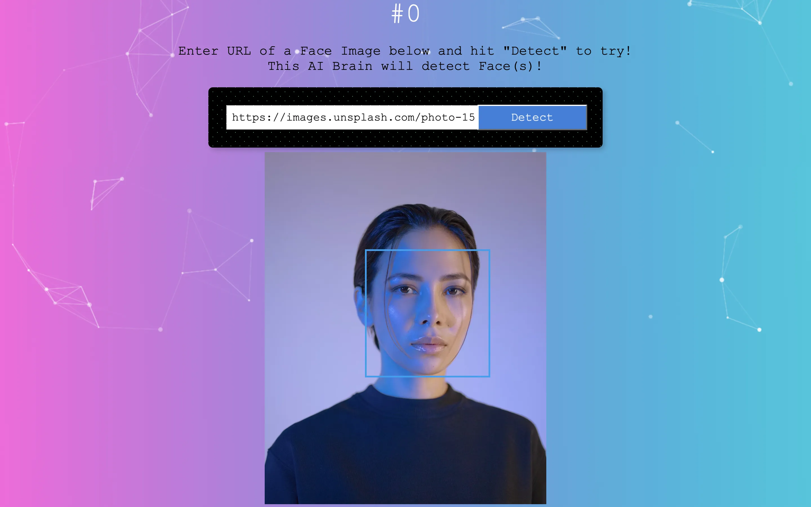

# Face Detector App

> Try Face Detection with ease.

<!-- [Insert Image/GIF Link Here] -->




\*face image from [unsplash.com](https://unsplash.com/photos/woman-wearing-black-crew-neck-shirt-3TLl_97HNJo)

## 🌐 Live Demo

[https://srjoy5000.github.io/ai-face-recognition/](https://srjoy5000.github.io/ai-face-recognition/)

---

## 🚀 Key Features

- **Core Functionality**: Paste any public image URL and the AI model draws bounding boxes around every detected face.
- **UI/UX**: Responsive and mobile-friendly design with animated particle background.
- **[Backend](https://github.com/srjoy5000/ai-face-recognition-api)**: This REST API backend uses Node.js and Express. Secure data handling.

## 🛠 Tech Stack

| Category     | Tools & Technologies                                                                                                                                                                                                |
| :----------- | :------------------------------------------------------------------------------------------------------------------------------------------------------------------------------------------------------------------ |
| **Frontend** |         |
| **Backend**  |   |
| **Database** |                                                                                                    |
| **CI/CD**    |                                                                                        |

---

## 📂 Project Structure

```
./
├── .github/
│   └── workflows/
│       └── deploy.yml          # GitHub Actions: build & deploy to GitHub Pages
├── src/
│   ├── components/
│   │   ├── facerecognition/    # Renders image + absolute-positioned bounding boxes
│   │   ├── imagelinkform/      # URL input + Detect button
│   │   ├── logo/               # Tilt-animated brain logo card
│   │   ├── navigation/         # Sign In / Sign Out / Register nav links
│   │   ├── rank/               # Displays user name and entry count
│   │   ├── Register/           # Registration form (calls POST /register)
│   │   └── SignIn/             # Sign-in form (calls POST /signin)
│   ├── App.jsx                 # Root component — owns all state & routing logic
│   ├── App.css
│   ├── index.css
│   └── main.jsx
├── index.html
├── vite.config.js
├── eslint.config.js
├── package.json
└── README.md
```

## 🏁 Quick Start

### Prerequisites

- Node.js v18+

### Setup

1. **Clone the repo:**
   ```bash
   git clone https://github.com/srjoy5000/ai-face-recognition.git
   cd ai-face-recognition
   ```
2. **Install dependencies:**
   ```bash
   npm install
   ```
3. **Run the app:**
   ```bash
   npm run dev
   ```

No environment variables are required — the backend API is publicly hosted.

## 🗺️ Roadmap

- [x] User sign-up / sign-in with entry count tracking
- [x] Client-side face detection via MediaPipe (no Clarifai API dependency)
- [x] GitHub Actions deployment to GitHub Pages
- [ ] Loading states during sign-in, register, and face detection
- [ ] User-visible error messages on API failures
- [ ] Image file upload support (in addition to URL input)

## 📄 License

This project is licensed under the MIT License.

---

**Developed by srjoy5000**  
[GitHub](https://github.com/srjoy5000)
